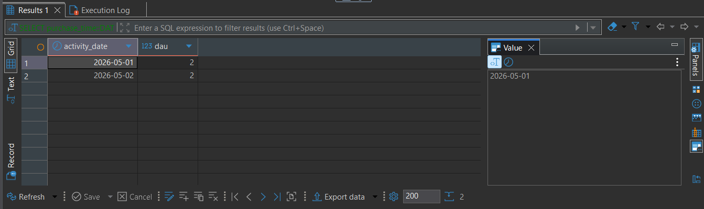
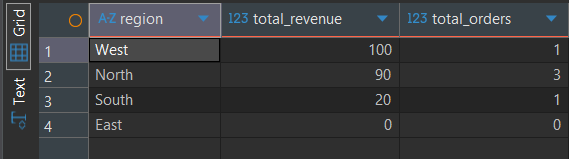
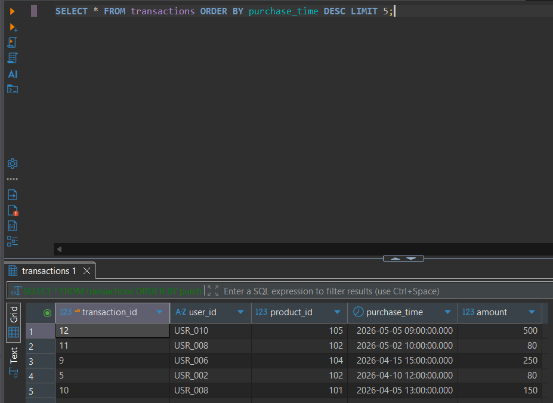

## 📂 Project Structure
- `/sql_scripts`: Database schemas and analytical queries.
- `/projects`: End-to-end data pipelines.

---

## ✅ Progress Log

### Week 1: Analytical Foundations (SQL & Git)
- **Day 1: Environment Setup & RDBMS Basics**
  - Configured PostgreSQL and DBeaver.
  - Initialized Git for version control.
  - **Case Study:** Calculated Daily Active Users (DAU) for an e-commerce dataset.
  - **Key SQL Used:** `CREATE TABLE`, `INSERT INTO`, `COUNT(DISTINCT)`, `GROUP BY`.
 

- **Day 2: Relational Logic & Joins**
  - **Theory:** Mastered the difference between Inner and Left Joins.
  - **Practice:** Solved the "Rising Temperature" logic using a Self-Join.
  - **Industry Case:** Built a Regional Revenue report to identify growth opportunities in underperforming areas (handling NULLs with `COALESCE`).
  - **Tools:** DBeaver, PostgreSQL, Git organization.

- **Day 3: Window Functions & Growth Metrics**
  - **Concepts:** CTEs (WITH), Window Functions (RANK, LAG), and defensive coding (NULLIF).
  - **Metrics:** Calculated Month-over-Month (MoM) Growth and Customer Spending Tiers.
  - **Data Integrity:** Implemented ROW_NUMBER() strategies to detect and remove duplicate transactions.

- **Day 4: Python ETL Pipelines & Data Ingestion**
  - **Core Concept:** Transitioned from manual SQL to automated **ETL (Extract, Transform, Load)** using Python.
  - **Tech Stack:** Integrated **Pandas** for data manipulation and **SQLAlchemy** as the database ORM bridge.
  - **Production Standards:**
    - **Logging:** Implemented the `logging` library to track pipeline health and catch 2 AM failures.
    - **Defensive Programming:** Built error-handling blocks (`try-except`) to prevent pipeline crashes during database downtime.
    - **Data Sanitization:** Created Python logic to clean "dirty" source data (e.g., trimming whitespace, case normalization) before database insertion.
    - **Scalability:** Utilized **Chunking** (`chunksize`) to handle large datasets without exhausting system memory.
  - **Idempotency & Safety:** Documented the risks of `if_exists='replace'` vs `append` to ensure historical data integrity.
 

